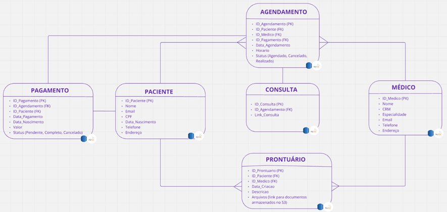

## Healthcore
## Sumário
- [Requisitos](#requisitos)
    - [Requisitos Funcionais](#requisitos-funcionais)
    - [Requisitos Não Funcionais](#requisitos-não-funcionais)
    - [Solução Healthcore](#solução-healthmed)
    - [Cadastro e Login](#cadastro-e-login)
    - [Busca e Agendamento de Consultas](#busca-e-agendamento-de-consultas)
    - [Gerencia o Pagamento](#gerencia-o-pagamento)
    - [Prontuário Eletrônico e Teleconsulta](#prontuário-eletrônico-e-teleconsulta)
    - [Monitoramento e Segurança](#monitoramento-e-segurança)
    - [Benefícios desta arquitetura](#benefícios-desta-arquitetura)
    - [AWS S3](#aws-s3)
    - [AWS RDS -PostgreSQL](#aws-rds--mysql)

## Requisitos

### Requisitos Funcionais
1. **Autenticação do Usuário (Médico)**
    - O sistema deve permitir que o médico faça login usando o número de CRM e uma senha.
2. **Cadastro/Edição de Horários Disponíveis (Médico)**
    - O sistema deve permitir que o médico cadastre e edite os horários disponíveis para agendamento de consultas.
3. **Aceite ou Recusa de Consultas Médicas (Médico)**
    - O médico deve poder aceitar ou recusar consultas médicas agendadas.
4. **Autenticação do Usuário (Paciente)**
    - O sistema deve permitir que o paciente faça login usando um e-mail, CPF e uma senha.
5. **Busca por Médicos (Paciente)**
    - O sistema deve permitir que o paciente visualize a lista de médicos disponíveis, utilizando filtros como especialidade, distância (em kms) e avaliação.
6. **Agendamento de Consultas (Paciente)**
    - Após selecionar o médico, o paciente deve poder visualizar a agenda do médico e o valor da consulta, e efetuar o agendamento.
    - O usuário paciente poderá cancelar a consulta mediante justificativa.
7. **Teleconsulta**
    - A consulta agendada deve criar um link de reunião online de duração padrão de 50 minutos que será utilizado pelo usuário e pelo médico no dia da consulta.
8. **Prontuário Eletrônico**
    - **Acesso e Upload:** O paciente deve poder acessar seu prontuário eletrônico e fazer o upload de arquivos, como exames e laudos médicos.
    - **Gestão de Compartilhamento:** O paciente deve poder compartilhar seu prontuário com médicos, definindo quais arquivos ou grupos de arquivos serão acessíveis e por quanto tempo.

### Requisitos Não Funcionais
1. **Alta Disponibilidade**
    - O sistema deve estar disponível 24/7 devido à sua natureza crítica no setor de saúde.
2. **Escalabilidade**
    - O sistema deve ser capaz de lidar com alta demanda, especialmente para profissionais muito procurados.
    - O sistema deve suportar até 20.000 usuários simultâneos em horários de pico.
3. **Segurança**
    - O prontuário eletrônico deve possuir alta camada de segurança para prevenir falhas no compartilhamento de documentos.
    - A proteção dos dados sensíveis dos pacientes deve seguir as melhores práticas de segurança da informação.

## Solução Healthcore

### Cadastro e Login
#### Cadastro do Paciente/Médico:
1. O usuário acessa a página de cadastro no Frontend.
2. O formulário de cadastro é preenchido e enviado ao AWS API Gateway.
3. O API Gateway encaminha a solicitação ao microserviço de Gestão de Usuários no EKS, que é o responsável pela criação, atualização e exclusão de contas de usuários.
4. O microserviço de Gestão de Usuários armazena as informações no Amazon RDS.
5. Os dados sensíveis são criptografados usando AWS KMS.

#### Login do Paciente/Médico:
1. O usuário acessa a página de login no Frontend.
2. As credenciais de login são enviadas ao AWS API Gateway.
3. O API Gateway encaminha a solicitação ao microserviço de Login no EKS, que é o responsável pela Autenticação de Usuários.
4. O microserviço de Login verifica as credenciais no Amazon RDS.
5. Se as credenciais estiverem corretas, o microserviço de Login gera um token JWT usando AWS Cognito, que é o responsável por autenticar os usuários e fornecer tokens JWT que são usados para autorizar as solicitações através do API Gateway.
6. O token JWT é retornado ao usuário via Frontend.

### Busca e Agendamento de Consultas
#### Busca de Médicos:
1. O paciente realiza uma busca por médicos usando filtros no Frontend.
2. A solicitação de busca é enviada ao AWS API Gateway.
3. O API Gateway encaminha a solicitação ao microserviço de Busca de Médicos no EKS, que é o responsável pela busca por médicos com base em critérios específicos.
4. O microserviço de Busca de Médicos consulta o Amazon RDS e retorna a lista de médicos ao Frontend.

#### Agendamento de Consulta:
1. O paciente seleciona um médico e um horário disponível no Frontend.
2. A solicitação de agendamento é enviada ao AWS API Gateway.
3. O API Gateway encaminha a solicitação ao microserviço de Agendamento de Consultas no EKS.
4. O microserviço de Agendamento de Consultas verifica a disponibilidade do médico e reserva o horário no Amazon RDS.
5. O microserviço de Agendamento de Consultas comunica-se com o microserviço de Pagamento para iniciar o processo de pagamento, que é acionado pelo microserviço de Agendamento.

### Gerencia o Pagamento
#### Pagamento via PIX
**Processo de Pagamento via PIX:**
1. O microserviço de Pagamento inicia o pagamento utilizando AWS Step Functions. Optamos pelo AWS Step Functions para orquestrar o processo de pagamento e compensação, implementando o padrão SAGA para garantir a consistência.
2. O AWS Step Functions coordena as seguintes etapas:
    1. Cria uma solicitação de pagamento PIX e envia ao Mercado Pago.
    2. O Mercado Pago processa a transação e retorna à confirmação ou negação.
    3. Se o pagamento for confirmado, o microserviço de Pagamento atualiza o status do pagamento no Amazon RDS.
    4. O microserviço de Pagamento comunica o resultado ao microserviço de Agendamento de Consultas, que é responsável pelo gerenciamento de agendamentos de consultas.
    5. Se o pagamento for negado, o fluxo é cancelado e o status do agendamento é atualizado para "cancelado".

### Prontuário Eletrônico e Teleconsulta
#### Acesso ao Prontuário Eletrônico:
1. O paciente ou médico acessa o prontuário eletrônico via Frontend.
2. A solicitação é enviada ao AWS API Gateway.
3. O API Gateway encaminha a solicitação ao microserviço de Prontuário Eletrônico no EKS, que é o responsável pelo acesso e atualização de prontuários eletrônicos.
4. O microserviço de Prontuário Eletrônico consulta os metadados no Amazon RDS.
5. Os documentos médicos são acessados no Amazon S3, onde são armazenados criptografados usando AWS KMS.
6. O microserviço de Prontuário Eletrônico retorna os dados ao Frontend.

#### Realização de Teleconsulta:
1. No dia da consulta, o paciente e o médico acessam o link da teleconsulta via Frontend.
2. A solicitação é enviada ao AWS API Gateway.
3. O API Gateway encaminha a solicitação ao microserviço de Teleconsulta no EKS, que é o responsável pela geração de links de videoconferência para consultas.
4. O microserviço de Teleconsulta gera um link de videoconferência usando o AWS Chime SDK e retorna o link ao Frontend. O AWS Chime SDK possibilita a conexão entre profissionais médicos e pacientes por chat e chamada de vídeo para consultas remotas, incorporando comunicação em tempo real.

### Monitoramento e Segurança
#### Monitoramento e Logging:
1. Todas as atividades do sistema são monitoradas usando AWS CloudWatch.
2. Logs são coletados e analisados usando Amazon Elasticsearch para troubleshooting e auditoria.

#### Segurança de Dados:
1. Dados sensíveis são criptografados usando AWS KMS.
2. Controle de acesso é gerenciado pelo AWS IAM para garantir permissões adequadas.

### Benefícios desta arquitetura
- **Segurança Aprimorada:** Utilização de AWS KMS para criptografia de dados e AWS IAM para controle de acesso.
- **Monitoramento Completo:** AWS CloudWatch fornece monitoramento contínuo e AWS Elasticsearch permite análise de logs detalhada.
- **Escalabilidade e Resiliência:** Load Balancer e Auto Scaling garantem que a aplicação possa lidar com variações na demanda de forma eficiente.
    - Uso do AWS Load Balancer à frente do serviço de API Gateway para distribuir o tráfego de entrada entre vários endpoints do backend. Isso ajuda a melhorar a disponibilidade e escalabilidade do serviço de API Gateway.
    - O AWS AutoScaling ajustará automaticamente o número de nós e pods em resposta à carga de trabalho, garantindo desempenho otimizado e custo-eficiência.
- **Gestão Eficiente de Dados:** Separação clara entre dados estruturados no Amazon RDS e dados não estruturados no Amazon S3.

### AWS S3
**Dados Não Estruturados:**
Documentos médicos e arquivos de exames, laudos médicos, resultados de testes, imagens de radiologia, e outros documentos médicos dos prontuários eletrônicos são armazenados no Amazon S3, que é ideal para armazenar grandes quantidades de dados não estruturados, permitindo fácil acesso e gerenciamento de arquivos.

**Exemplo - Estrutura Interna:**

### AWS RDS - PostgreSQL
**Dados Estruturados:**
Informações sobre usuários, agendamentos, pagamentos e metadados dos prontuários eletrônicos são armazenados no Amazon RDS-PostgreSQL. Esses dados são críticos para operações transacionais e consultas complexas, garantindo integridade referencial e consistência.

